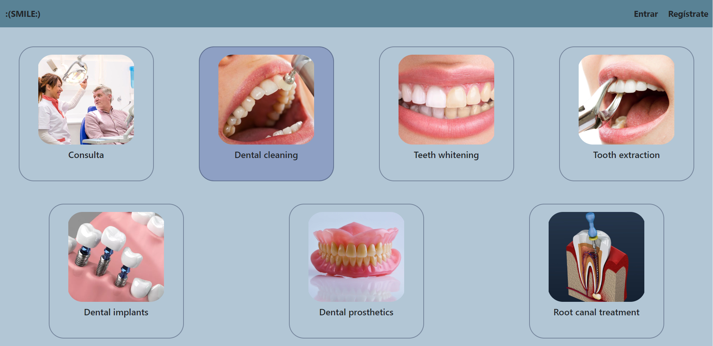
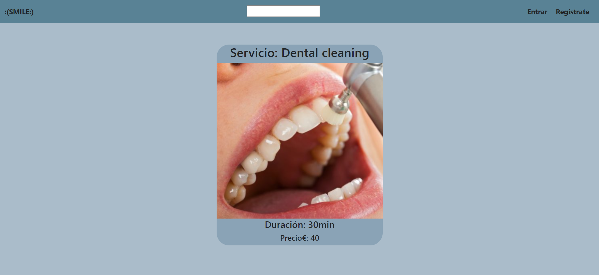

## REACT - Frontend App - Clínica dental.

### Tecnologías:

### Descripción general del proyecto 

Diseño y desarrollo de un FRONTEND para una APP funcional.

### REGISTRO

### LOGIN

### HOME

### PERFIL

### USUARIOS

### VISTA DETALLE SERVICIOS

### Agradecimientos:

Agradezco a mis compañeros el tiempo dedicado a este proyecto.

### Autor:
Jorge Luis Martin Lorenzo.
