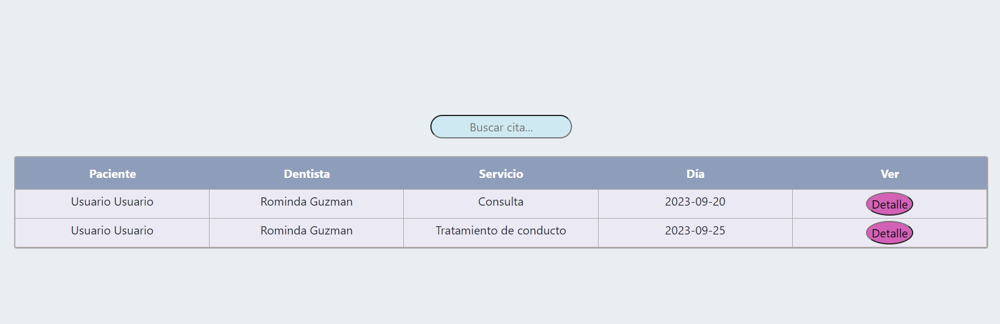

## REACT - Frontend App - Clínica dental.

### Tecnologías:

+ REACT.
+ JAVASCRIPT.
+ REACT BOOTSTRAP.
+ REACT REDUX.
+ HTML.
+ CSS.

### Descripción general del proyecto 

Diseño y desarrollo de un FRONTEND para una APP funcional de una clínica dental.

Cuenta con 2 tipos de usuarios:

Pacientes: (role por defecto) una vez registrados podrán editar su perfil, crear la cita de interés teniendo la oportunidad de escoger fecha, hora, servicio y dentista. También podrán ver el historial de sus citas, al igual que modificarla. Se permitirá una cita por usuario para evitar spam.

Admin: todo aquel usuario con role de Admin podrá ver todos los usuarios y citas en la app, para la facilidad del mismo, se añade una barra de busqueda, que acepta Nombres de pacientes o dentistas y fecha. (Si desea buscar por nombre, no olvidar mayúsculas).

### REGISTRO

El primer paso será registrarse, para poder acceder a todos los beneficios de la app.

### LOGIN

Una vez registrados, se redigirá a la página del login para que ingrese el email y contraseña.

### HOME

La única página que estará disponibles para todos será la del Home, para que puedan ver los servicios.

### VISTA DETALLE

Si se hace clic en la imagen se redigirá a una vista detalle para que pueda ver mas información del mismo incluyendo el precio y duración.

### PERFIL

Cuenta con una página para ver y editar datos de usuario en caso de necesitarlo.

### ADMIN

Los Admin, contarán con una vista privada para poder llevar el control de la clínica.

### USUARIOS

El Admin será capaz de ver todos los usuarios registrados en el sistema.

### CITAS ADMIN

En caso de que los doctores/admin deseen buscar todas sus citas, dispondrán de un panel de búsqueda que filtará por nombre y fecha.

### PACIENTES

Los pacientes contarán con una vista privada para solicitar la cita de su interés e incluso modificarla en caso de necesitarlo.

### CITAS PACIENTES

Podrán ver el historial de sus citas.

### VISTA DETALLE DE LA CITA Y OPCIÓN DE MODIFICARLA

Si hacen clic en el botón detalle de la cita, les mostrará el detalle de la misma con opción de modificarla.

### Agradecimientos:

Agradezco a mis profesores y compañeros el tiempo dedicado a este proyecto.

### Autor:
Jorge Luis Martin Lorenzo.
