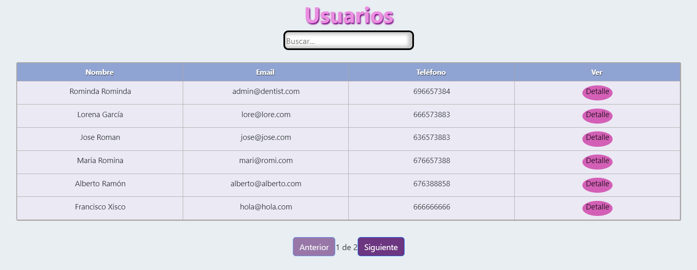
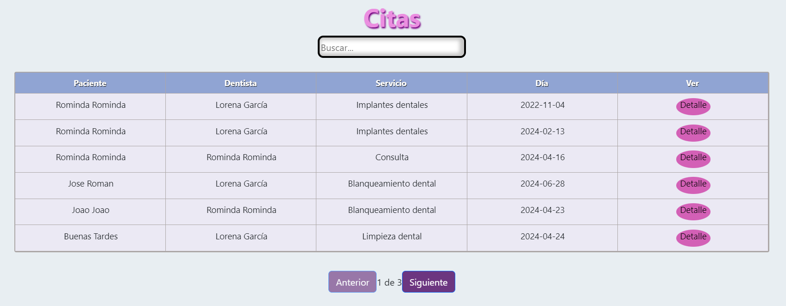

## REACT - Frontend App - Clínica dental.

#### [Enlace Backend](https://github.com/jorgemctin/Backend-DentalClinic)

### Tecnologías:

+ REACT.
+ JAVASCRIPT.
+ REACT BOOTSTRAP.
+ REACT REDUX.
+ HTML.
+ CSS.

### Descripción general del proyecto 

Desarrollo y diseño FRONTEND de una aplicación funcional para una clínica dental.

Los pacientes (role por defecto) una vez registrados podrán editar su perfil, crear la cita de interés, teniendo la oportunidad de escoger fecha, hora, servicio y dentista. También podrán ver el historial de sus citas, al igual que modificarla. El admin podrá ver todos las citas y usuarios registrados en la aplicación.

##### Puedes registrarte para una experiencia mas completa, o puedes acceder con estas credenciales: 

Usuario:
user@user.com - Hola1234

Administrador:
admin@dentist.com - Hola1234

### REGISTRO / LOGIN

El primer paso será registrarse, para poder acceder a todos los beneficios de la app. Una vez registrados, se enviará a la página del login para que ingrese el email y contraseña.

### HOME

La única página que estará disponible para todos será la del Home, para que puedan ver los servicios disponibles.

### VISTA DETALLE

Al hacer clic en la imagen, aparecerá a una vista detalle para que pueda ver más información del mismo, incluyendo el precio y duración.

### PERFIL

Cuenta con una página para ver y editar datos de usuario en caso de necesitarlo.

### ADMIN

Los Admin, contarán con un espacio privado para poder llevar el control de la clínica.

### USUARIOS

El Admin será capaz de ver todos los usuarios registrados en el sistema.

### DETALLE USUARIO

Tendrá la posibilidad de ver el detalle de cada usuario para ver todos los datos faltantes de la lista.

### CITAS ADMIN

En caso de que los doctores/admin deseen buscar todas sus citas, dispondrán de un panel de búsqueda.

### PACIENTES

Los pacientes contarán con una vista privada para solicitar la cita de su interés e incluso modificarla en caso de necesitarlo.

### CITAS PACIENTES

Podrán ver el historial de sus citas.

### VISTA DETALLE DE LA CITA Y OPCIÓN DE MODIFICARLA

Si hacen clic en el botón detalle de la cita, les mostrará el detalle de la misma con opción de modificarla.

### Agradecimientos:

Agradezco a todos mis profesores y compañeros el tiempo dedicado a este proyecto.

### Autor:

Jorge Luis Martin Lorenzo.
